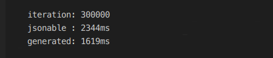

# Jsonable (v0.0.2)

to install:

```yaml
dependencies:
  jsonable: ^0.0.2
```

## what is Jsonable?

if you are interested in Jsoable with reflect [read here](./WithReflect.md)

Jsonable is a library that deals with offering a simple way to manage dart classes fromJson and toJson, allowing the transpiration from dart to json.
One of the main objectives and the philosophy of Jsoanble, is to remove the generated code making any object convertible into Json.

In the first version of Jsonable reflection was used, but this is not supported in the AOT compiler of dart.

**Jsonable does not use reflection or even generated code.**

## how to use?

Jsonable makes available a mixin `mixin Jsonable` within this mixin is the management of the Json scheme.
only by extending our class with the mixin, the class gets the necessary methods, but if we don't indicate the members of json, using "toJson" or "toMap" will be an empty Map / string. ({})

let's see an example:

```dart
import "package:jsonable/jsonable.dart";

class Person with Jsonable {
 JString name;
 JString surname;
  Person({String name, String surname}) {
    this.name = this.jString("name", initialValue: name);
    this.surname = this.jString("surname", initialValue: surname);
  }
}

main() {
  var p = Person(name: "Nico", surname: "Spina");
  print(p.toJson());
  // output: {"name":"Nico","surname":"Spina"}
}
```

Jsonable implements different types to represent the whole Json structure:

* `JString`
* `JNum`
* `JBool`
* `JClass<E extends Jsonable>`
* `JList<E>` 
* `JDynamic` ***this is  in experimentation***
* `JMap` ***this is  in experimentation***

Jsonable records these types and serializes and deserializes the structure based on these types

The functions provided by `Jsonable`:

* `JClass<E> jClass<E extends Jsonable>(keyname, JsonableConstructor constructor, {E initialValue}) `

  > It returns aJClass is `JType<Jsonable>` in the generic of this type, extends Jsonable, moreover it requires the constructor a simple function that returns an instance of that type.
  > Note: it will be instantiated immediately to the declaration if InitialValue is null

*  `JList<E> jList<E>(dynamic keyname, {List<E> initialValue, JsonableConstructor constructor})`

  > aJList represents a List that can contain any value, you can iterate overJList and you don't need to access the value via ".value", in this type the constructor parameter becomes mandatory if you are using a Jsonable as generic are not allowed types of data other than: bool, string, num, int, double, map, list,

* `JString jString(dynamic keyname, {String initialValue})` 

  > Return a `JType <String>` then manage a `String` type in the schema with `fromJson` will assign the value only if it is a `String`, in `toJson` it will assign a `String`, you can assign only `String` values via ".value"

* `JCool jBool(dynamic keyname, {bool initialValue})`

  > Return a `JType <bool>` then manage a `bool` type in the schema with `fromJson` will assign the value only if it is a `bool`, in `toJson` it will assign a `bool`, you can assign only `bool` values via ".value"

* `JNum jNum(dynamic keyname, {num initialValue})`

  > Return a `JType <num>` then manage a `num` type in the schema with `fromJson` will assign the value only if it is a `num`, in `toJson` it will assign a  `num`, you can assign only `num` values via ".value"

* `JMap jMap(dynamic keyname, {Map initialValue})`

  > Return a `JType <Map<E,R>>` then manage a `Map<E,R>` type in the schema with `fromJson` will assign the value  only if it is a `Map<E,R>`, in `toJson` it will assign a `Map<E,R>`, you can assign only `Map<E,R>` values via ".value"

* `JDynamic jDynamic(dynamic keyname, {dynamic initialValue})`

  > Return a `JType <dynamic>` then manage a `dynamic` type in the schema with `fromJson` will assign the value  only if it is a `dynamic`, in `toJson` it will assign a `dynamic`, you can assign only `dynamic` values via ".value"

## Performance

in this second release I had particular attention to performance: Jsonable is less than 50% slower than native (generated).
This test has not yet been made a benchmark with written tests.
Tests were made by timing, the result was:



**Note:** *I used dartVm not AOT*


### Conclusion

If you want you can support the development by offering me a beer: [paypal](https://www.paypal.com/donate/?token=vm8zFQO-fdND2nUoQj1Qlasgv_-HBXfWnCPrQByr004Dhj5jc2AeBesdxe9AVcIiPYlezG&country.x=IT&locale.x=IT)

If you can't buy beer, you can always leave me a star on [github](https://github.com/SpinaNico/jsonable).

thanks!